<div align="center">



</div>

<div align="center">

### Claude Code 用カスタムスキル集

[](https://claude.ai/code)
[](https://open.bigmodel.cn/)
[](LICENSE)

Claude Code を強化する、実用的なカスタムスキルコレクション。

</div>

---

## ✨ 概要

`zero-cc` は Claude Code の生産性を向上させるために作られたカスタムスキル集です。GitHub リポジトリの作成からメンテナンス、さらには新しいスキルの自動生成まで、開発ワークフローを自動化します。

## 📦 含まれるスキル

<div align="center">

| スキル | 説明 |
|:------:|------|
| **claude-code-extension-generator** | 自然言語から Claude Code 拡張機能（スキル/エージェント）を自動生成 |
| **repo-create** | GitHub リポジトリを新規作成・初期化 |
| **repo-maintain** | 既存リポジトリのメンテナンス（リリース/PR/Issue） |

</div>

---

### 🔧 claude-code-extension-generator

ユーザーの自然言語指示から Claude Code の拡張機能を自動生成するメタスキル。

**対応する拡張機能:**
- **スキル** - プロンプト再利用・専門知識・ワークフロー
- **サブエージェント** - 独立コンテキストの特化型AI
- **プロジェクト設定** - CLAUDE.md / .mcp.json

```bash
# スキルを作成
/claude-code-extension-generator コードレビューするスキルを作って

# サブエージェントを作成
/claude-code-extension-generator フロントエンドコードを最適化するエージェントを作って
```

---

### 📁 repo-create

GitHub リポジトリを新規作成・初期化します。

**機能:**
- `gh repo create` でリポジトリ作成
- README.md / .gitignore / LICENSE を自動生成
- initial commit を自動実行

```bash
/repo-create my-awesome-project
/repo-create my-app --private --description "My awesome app"
```

---

### 🚀 repo-maintain

既存 GitHub リポジトリのメンテナンス作業を支援します。

**機能:**
- **リリース作成** - Gitタグ + GitHubリリース + リリースノート生成
- **変更履歴** - コミットログから自動分類
- **プルリクエスト** - PR作成と説明文生成
- **イシュー作成** - テンプレートベースのIssue作成
- **状態確認** - リポジトリのサマリー表示

```bash
/repo-maintain release 1.0.0
/repo-maintain changelog
/repo-maintain pr "Add new feature"
/repo-maintain issue "Bug: Login fails"
/repo-maintain status
```

---

## 🚀 セットアップ

### 要件

- [GitHub CLI](https://cli.github.com/) (`gh`) がインストール済み
- `gh auth login` で認証済み

### インストール

1. このリポジトリをクローン
2. Claude Code でプロジェクトを開く
3. スキルが自動的に読み込まれます

```bash
git clone https://github.com/your-username/zero-cc.git
cd zero-cc
```

---

## 📁 構造

```
zero-cc/
├── .claude/
│   └── skills/
│       ├── claude-code-extension-generator/
│       │   └── SKILL.md
│       ├── repo-create/
│       │   └── SKILL.md
│       └── repo-maintain/
│           └── SKILL.md
├── assets/
│   └── header.svg
├── README.md
└── LICENSE
```

---

## 🤖 使用モデル

本プロジェクトの開発には **GLM-4.7** (Zhipu AI) が使用されています。

### GLM-4.7 について

- **開発者**: [Zhipu AI (智谱AI)](https://open.bigmodel.cn/)
- **リリース**: 2025年12月22日
- **特徴**: コーディングシーンに特化した最適化、マルチファイル処理、深い数学的推論
- **ツール互換性**: Claude Code を含む20以上のAIコーディングツールと互換性
- **ライセンス**: オープンウェイトモデル

---

## 📄 ライセンス

[MIT License](LICENSE)

---

<div align="center">

Made with ❤️ for [Claude Code](https://claude.ai/code)

</div>
